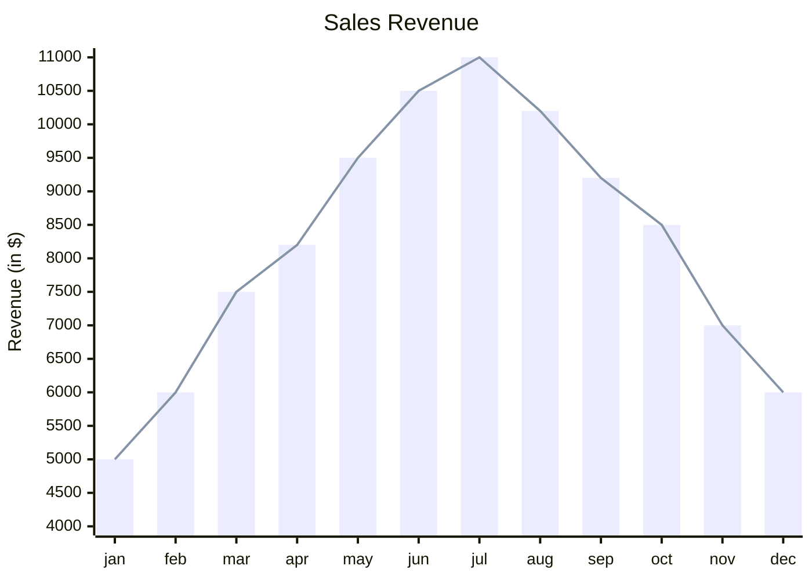
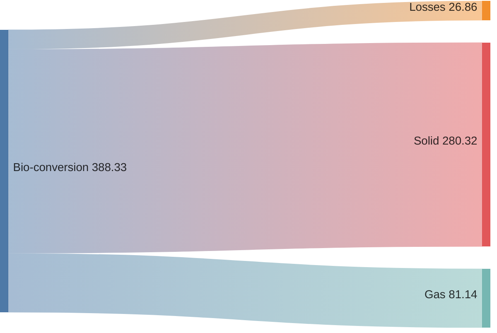
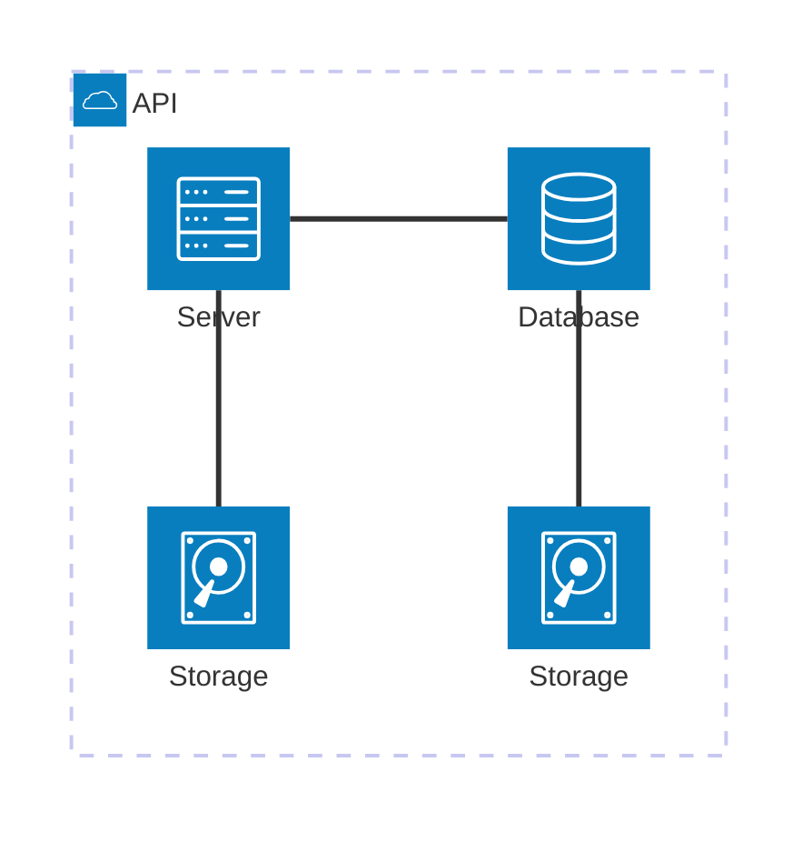
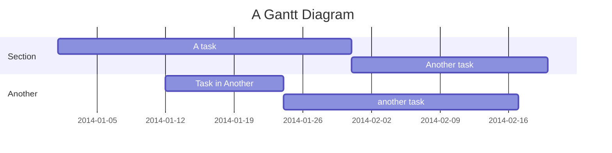
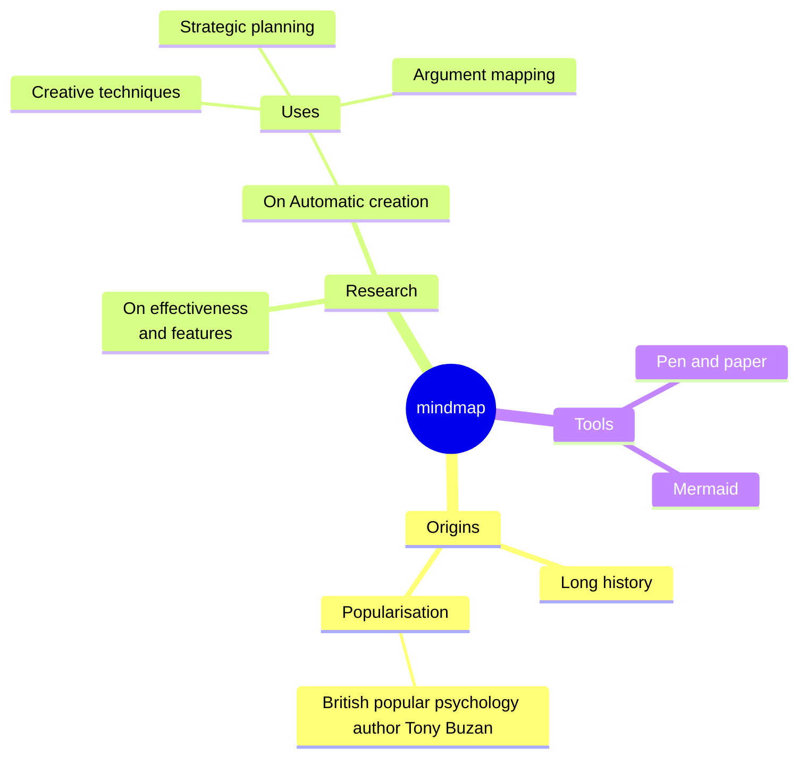

## XY-Chart

https://mermaid.js.org/syntax/xyChart.html

## Sankey Diagram

https://mermaid.js.org/syntax/sankey.html

## Architecture Diagram

https://mermaid.js.org/syntax/architecture.html

## Gantt Chart

https://mermaid.js.org/syntax/gantt.html

## Mind Map

https://mermaid.js.org/syntax/mindmap.html

